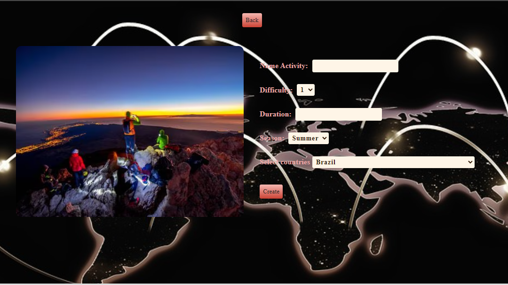

    

# Individual Project 

  

  

  

# link : https://pi-country.vercel.app/

## Project Objectives

- Build an App using React, Redux, Node and Sequelize.
- Affirm and connect the concepts learned in the race.
- Learn best practices.

## Statement

The general idea is to create an application in which you can see information from different countries using the external api
 [restcountries](https://restcountries.com/) and from it to be able, among other things:

- Search countries
- - Filter / Sort them
- Create tourist activities

### Endpoints/Flags that they can use

  - GET https://restcountries.com/v3/all
  - GET https://restcountries.com/v3/name/{name}
  - GET https://restcountries.com/v3/alpha/{code}

#### Required technologies:
- [ ] React
- [ ] Redux
- [ ] Express
- [ ] Sequelize - Postgres

#### Frontend

A React/Redux app should be developed that contains the following screens/routes.

__Initial page__: they must create a landing page with
- [ ] Some representative background image to the project
- [ ] Button to enter home (`Main Path`)

__Main path__: must contain
- [ ] Search input to find countries by name
- [ ] Area where the list of countries will be seen. When starting, you must load the first results obtained from the route `GET /countries` and you must show your:
  - flag image
  - Name
  - Continet
- [ ] Buttons/Options to filter by continent and by type of tourist activity
- [ ] Buttons/Options to sort both ascending and descending countries by alphabetical order and by amount of population
- [ ] Paging to search and display the following countries, 10 countries per page, showing the first 9 on the first page.

__Country Detail Path__ - Must contain
- [ ] The fields displayed in the main path for each country (flag image, name, 3-letter country code, and continent)
- [ ] 3 letter country code (id)
- [ ] Capital
- [ ] Subregión
- [ ] Area (Show it in km2 or million km2)
- [ ] Population
- [ ] Tourist activities with all their associated information

__Tourist activity creation route__: must contain
- [ ] A __JavaScript controlled__ form with the following fields:
  - Name
  - Difficulty
  - Duration
  - Season
- [ ] Possibility to select/add several countries simultaneously
- [ ] Button/Option to create a new tourist activity

#### Database

The database model must have the following entities (Those properties marked with an asterisk must be mandatory):

- [ ] Country with the following properties:
  - ID (3 letter code) *
  - Name *
  - flag image *
  - Continent *
  - Capital *
  - Subregión
  - Área
  - Population
- [ ] Tourist Activity with the following properties:
  - ID
  - Name
  - Difficulty (Between 1 and 5)
  - Duration
  - Season (Summer, Autumn, Winter or Spring)

The relationship between both entities must be many-to-many since a country can contain several tourist activities and, in turn, a tourist activity can take place in multiple countries. For example, an activity could be "Ski" which could take place in Argentina and also in the United States, but Argentina could also include "Rafting".

#### Backend

A server must be developed in Node/Express with the following paths:

- [ ] __GET /countries__:
  - In the first instance, they must bring all the countries from restcountries and save them in their own database and then use them from there (You must store only the necessary data for the main route)
  - Get a list of countries.
- [ ] __GET /countries/{idPais}__:
  - Get the detail of a particular country
  - You must bring only the data requested in the country detail route
  - Include the data of the corresponding tourist activities
- [ ] __GET /countries?name="..."__:
  - Get the countries that match the name passed as a query parameter (does not necessarily have to be an exact match)
  - If no country exists display an appropriate message
- [ ] __POST /activity__:
  - Receives the data collected from the controlled form of the tourist activity creation route by body
  - Create a tourist activity in the database

